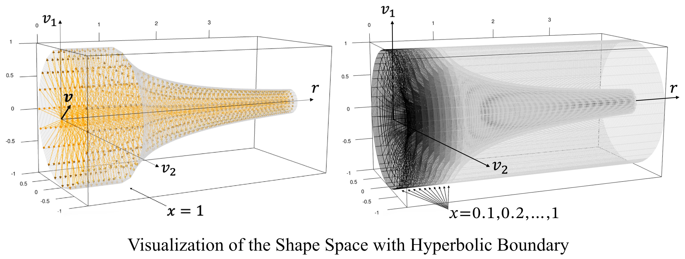
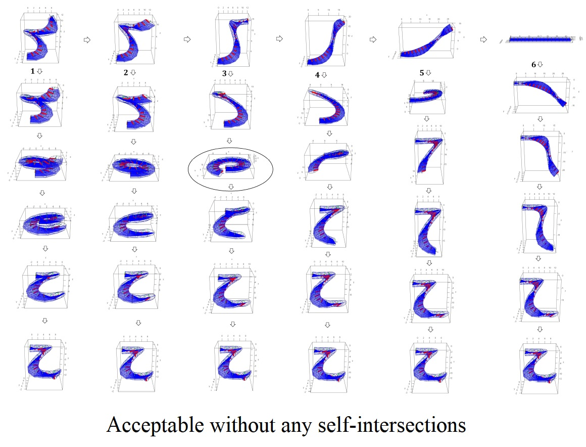

The repository is linked to the publication mentioned below.

## Article
### "The Mean Shape under the Relative Curvature Condition"
### Taheri, Mohsen, Stephen M. Pizer, and Jörn Schulz. Submitted to the Journal of Computational and Graphical Statistics.
### The article is part of the PhD thesis "Shape Statistics via Skeletal Structures", Mohsen Taheri Shalmani, University of Stavanger, Norway.

## The manuscript provides shape statistics for elliptical tubes, utilizing a relative curvature condition to ensure avoidance of self-intersections.

---

## Article "The Mean Shape under the Relative Curvature Condition"
[ETRep_arxiv.pdf](ETRep_arxiv.pdf)

## PhD Thesis "Shape Statistics via Skeletal Structures"
[PhD Thesis](https://uis.brage.unit.no/uis-xmlui/handle/11250/3133161)

## Cite
```
@misc{taheri2024mean,
      title={The Mean Shape under the Relative Curvature Condition}, 
      author={Mohsen Taheri and Stephen M. Pizer and Jörn Schulz},
      year={2024},
      eprint={2404.01043},
      archivePrefix={arXiv},
      url={https://doi.org/10.48550/arXiv.2404.01043},
      primaryClass={stat.ME}
}
```

# ETRep R Package

**ETRep** R package is designed for the analysis of elliptical tubes, applying the Relative Curvature Condition (RCC) for enhanced shape analysis. This package provides tools for computational and graphical methods relevant to studies involving tubular structures and shape simulation, making it a handy framework for research in fields such as biological shape analysis, robotic arm transformations, and geometry.

## Citation

If you use **ETRep** in your research, please cite it as follows:

**APA Style:**  
Taheri, M. (2024). *ETRep: Analysis of Elliptical Tubes Under the Relative Curvature Condition* (Version 0.1.0) \[R package\]. The Comprehensive R Archive Network (CRAN). [https://doi.org/10.32614/CRAN.package.ETRep](https://doi.org/10.32614/CRAN.package.ETRep)

## Installation

To install **ETRep** from CRAN, use:
```R
install.packages("ETRep")
```

## Overview

**ETRep** offers a range of functions and documentation to aid in analyzing and visualizing elliptical tubes. The package supports complex shape simulations and includes supplementary materials to help users navigate its functionality effectively.

---


## Images from the article




### A depiction of the simulated ETReps and their mean shape.


### Visualization of a valid transformation without any self-intersections



